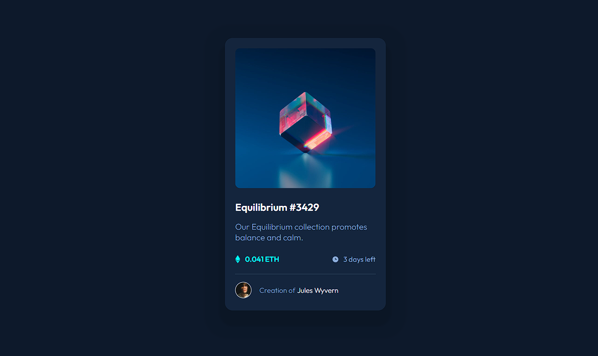

# Frontend Mentor Challenge - NFT Preview Card Component

## The result

Preview the site by clicking [here]()!

This was my second Frontend Mentor challenge and I am really proud of the result I got. 

## The process

During development I was able to practice my CSS skills a lot. It was really nice to learn more and get used to coding in this language, which is essential for the frontend stack.

## Next steps

To keep improving and developing myself as a software engineer, I will study new subjects and build more projects in Frontend Mentor.

My next goals are to learn:

- Responsive layout
- Grid layout

**Let's code!** 🚀
